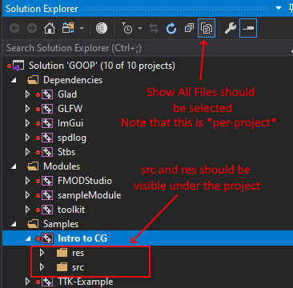

# Welcome to the Ontario Tech Teaching and Education Repository (OTTER) Tookit

## Overview

The _OTTER_ toolkit is a collection of libraries and tools that aims to aid educators in teaching graphics and other game programming concepts.

_OTTER_ has 3 important concepts:

- **Dependencies** are libraries that are required by all projects, they should have minimal or no inter-dependencies with each other
- **Modules** are projects that can be used by samples and user projects to add additional functionality on top of the dependencies
  - Modules are the ideal way to provide additional code or framework to users of the toolkit
- **Samples** and **User Projects** are projects that link all of the dependencies and modules into a single project
  - _Samples_ - provides a place for examples from the professor or TA that should not be modified by users of the toolkit (used as references by students)
  - _User Projects_ - are projects where a student can actually make use of the toolkit

## Included Libraries

The following libraries are currently included as dependencies for OTTER:

- [Cereal](https://uscilab.github.io/cereal/) - A Serialization library
- [ENTT](https://github.com/skypjack/entt) - A fast single-header Entity Component System
- [FMOD Core](https://www.fmod.com/) - An industry-standard audio API
- [glad](https://glad.dav1d.de/) - An OpenGL extension wrangler (We're using OpenGL 4.6)
- [GLFW3](https://www.glfw.org/) - A windowing and input library
- [GLM](https://glm.g-truc.net/0.9.9/index.html) - A game math library (fast vectors and matrices)
- [gzip](https://github.com/mapbox/gzip-hpp) - A utility to allow for easy compression and decompression of data
- [Dear ImGui](https://github.com/ocornut/imgui) - An immediate mode GUI for debugging
- [spdlog](https://github.com/gabime/spdlog) - A fast logging library
- [Tiny glTF](https://github.com/syoyo/tinygltf) - A minimal model loader supporting the GLTF format
- [JSON for Modern C++](https://github.com/nlohmann/json) - Allows reading and writing JSON formatted data (also used by Tiny glTF)
- [Various STB Libraries](https://github.com/nothings/stb)- A collection of small helper utilities by Sean Barret (A surprising number of other libraries are built off the STBs, I'd highly recommend taking a look at them)

# For Students

## Basic Usage

To get started with the toolkit, you will want to add a new folder called _**projects**_ in the root of the toolkit. This folder will contain all of our projects that we want to add to our solution. The structure for these folders is as follows:

```
 └┬─ OTTER
  ├──┬ projects
  │  ├──┬ Project 1
  │  │  ├─┬ res
  |  |  | └─ images, shaders, etc. go here
  │  │  └─┬ src
  │  │    └─ code goes here
  │  └──┬ Project 2
  │     ├─ res
  │     └─ src
  . . .
```

After adding a new folder for projects, you can run `premake_build.bat` to compile the solution (by default this will compile in VS 2019). If you need to change the Visual Studio version, or build for another IDE, you can modify the one-line `premake_build.bat`, and change `vs2019` to whatever platform is applicable. See the [premake wiki](https://github.com/premake/premake-core/wiki/Using-Premake) for all available platforms

## User Project and Sample Layouts

_User Projects_ and _Samples_ consist of two folders, `res` and `src`. `res` will contain any files that should be copied to the build output. For instance, this is where you would want to put assets that you want to load in. `src` will contain all of the source code for the project. I would highly recommend to use the `Show All Files` view in Visual Studio Solution Explorer when working in the toolkit.

_Samples_ is handled a bit differently from the user projects, in that the samples should be nested under an additional folder with the subject. For instance:

 ```
  ├──┬ samples            
  │  ├─┬Subject 1          
  │  │  └─┬Sample 1        
  │  │    ├─ res           
  │  │    └─ src              
  │  └─┬Subject 2         
  │     └─┬Sample 1        
  │       ├─ res           
  │       └─ src         
```

Each subject will be given it's own folder in Visual Studio, prefixed with `Samples - `, so for the example above, _OTTER_ would generate `Samples - Subject 1` and `Samples - Subject 2` folders.

> Important: If 'Show All Files' is not enabled, Visual Studio will **not** create new files in the correct location, potentially breaking your project and making submission very painful



## Generated folders

When compiling a project, your build tool will create 2 folders, `bin` for the output of the build, and an `obj` for intermediate build files. Additionally, when you first run `premake_build.bat`, a `shared_assets` folder that contains all of the assets that are included in modules will be generated and populated. These folders can be removed to save space when transferring the toolkit between devices. Visual Studio will also generate a hidden `.vs` folder, which can be safely deleted.

> Important: Do not delete the .git folder if you wish to track changes using GIT

## Sending/Submitting Projects

To send a project to someone else using the toolkit (provided that you have the same modules installed), you will only need to send them your _User Project_ folder under _**projects**_ (ex: Project 1 from the example above)

> Note: To further minimize bloat, you can remove the _.vxproj_ files from your submission as well

# For Professors and TAs

## Modules

Modules are a way for Instructors and TAs to extend the functionality of the _OTTER_ toolkit, and to add new features and tools for students to use.

Modules are similar to dependencies in that all _Samples_ and _User Projects_ will be linked against them, but they differ in that that are much simpler to create, add and remove. All modules are stored under the _**Modules**_ folder in the toolkit, and can be either a simple C/C++ project, or a more advanced premake project. All modules should have an _**include**_ folder that contains all of the header files required to use that module.

One improvement _OTTER_ has over it's predecessor is that modules can now support adding DLLs or resources that will get copied to client projects. This allows the development of content-only modules, which do not contain compiled code, but rather collections of assets that client projects may use. 

> Note: client projects may override any assets defined by a module

## Adding Code Modules

There are two ways to add a code module to the _OTTER_ toolkit.

The simplest way is to allow the toolkit to automatically generate a project for the module. This can be achieved by adding a new folder under _**Modules**_ to store your module, and adding a _**src**_ and _**include**_ folder under this folder, for your source and header files respectively. _OTTER_ will generate a project in the solution, link the module against the dependencies, and link the module to the _Samples_ and _User Projects_.

If you want to add a module that has an existing .lib file, you will need to ensure that it was compiled as _x64_, and only a single lib is allowed at a time (for instance, if you have a debug version and a release version, _OTTER_ will not be able to differentiate these, you must select one to use). Place these libs under a folder named _libs_ in your modules directory. Note that all modules need at least one .c or .cpp file in order for the module's lib file to generate, if your module does not have any c files, you can add a dummy.cpp file under src that includes one or all of your header files.

> Warning: If your module does not generate a lib file, client projects will fail to build when your module is present. You **MUST** ensure that your module will generate it's own .lib file.

Alternatively, you can provide a premake file under your module directory, and _OTTER_ will include that project in it's build. Note that using a separate premake file _**will not**_ automatically link the dependencies to the module, this will need to be done manually. Additionally, in order for the _Samples_ and _User Projects_ to properly include the module, you _**must**_ have your headers in an _include_ folder under the module.

## Adding Resource Modules

Modules do not require code in _OTTER_, it is possible to include only resources that will be copied into the client applications working directories. To create a resource module, simply include a _**res**_ and/or _**dll**_ folder under your module.

## Resource/DLL Copy Order

Resources that are defined by a module may be overwritten by either another module or the client application. Thus it is important to understand the order in which resource copying takes place.

The first step of generating modules is to extract their resources and DLLs into the _**shared_assets**_ folder. This is done by copying the _**res**_ and _**dll**_ folder of each module into _**shared_assets/res**_ and _**shared_assets/dll**_ respectively. Modules are handled in alphabetical order, thus if you have two modules that define the same resource (for instance _**AModule**_ and _**BModule**_ both define a *data_source.txt* resource), the resource that is last when sorted alphabetically will overwrite any prior resource (in our example, *data_source.txt* will come from _**BModule**_).

The same approach is taken when copying DLL files.

When a project is recompiled, the post build will copy any newer files into the output directory in the given order:

1. Module DLL files copied next to output
2. Dependency DLL files copied next to output
3. Module assets (_**/res**_) copied to output
4. Project assets (_**/res**_) copied to output

Thus, dependencies take precedence over modules for DLLs, and client projects take precedence over modules for assets

## Folder Structure

 ```
 Folder Structure          | Usage
 ===================================================
 └┬─ _OTTER_               | Root folder
  ├─ clean.bat             | Removes all solution and project files, as well as the bin, obj, and .vs folders
  ├─ premake_build.bat     | Builds the project and generates the solution and projects
  ├─ premake5.lua          | The build file
  ├─ premake5.exe          | The underlying build tool (Premake 5)
  ├─ readme.md             | This file!
  ├─ .gitignore            | Our toolkit's gitignore, for removing unneeded files from the toolkit when uploading to a git repo
  ├──┬ dependencies        | The core dependencies for the toolkit
  |  ├─ dep 1              |
  |  ├─ dep 2              | This is the core of OTTER, you shouldn't ever need to worry about the dependencies!
  │  ├─ etc...             |
  │  └─┬ dll               | This folder contains any dlls that are required by a dependency, will be copied to debug directory
  │    ├─ dep1.dll         |
  │    └─ etc...           |
  ├──┬ modules             | Modules to extend the toolkit
  │  ├─┬ Module 1          | The name of the module as it will appear in the work space
  │  │ ├─ libs             | Any .lib files that should be linked to this project, not that these will *NOT* be linked to the client projects
  │  │ ├─ src              | The source code for the module
  │  │ ├─ dll              | Contains any DLLs that this module wishes to include with client projects
  │  │ ├─ res              | Contains any resources that the module wishes to include in client projects
  │  │ └─ include          | The header files for the module, this will be an include directory for client projects
  │  └─┬ Module 2          |
  │    ├─ premake5.lua     | Modules can optionally use a premake file, note that it is still expected to have an include
  │    └─ include          |   folder for the module's headers
  ├──┬ projects            | User projects
  │  ├─┬ Project 1         | The folder name will be the name of the project in your workspace
  │  │ ├─ res              | Any files in the resources folder will be copied to the build output
  │  │ └─ src              | Any c, cpp or h files under src will be included in the project and compiled
  │  └─┬ Project 2         |
  │    ├─ res              |
  │    └─ src              |
  ├──┬ samples             | Example projects (should not be modified by user of toolkit)
  │  └─┬Subject 1          |
  │     └─┬Sample 1        |
  │       ├─ res           | See projects
  │       └─ src           |
  ├──┬ shared_assets       | Stores the assets and dlls defined by modules
  │  ├─ dll                |
  │  └─ res                |
  ├──┬ bin                 | Stores the output files (exe, resources, etc) for the projects and samples
  │  └─┬ (platform code)   |
  │    ├─┬ Project 1       |
  │    │ ├─ Project 1.exe  |
  │    │ ├─ resource.png   |
  │    │ ├─ dep1.dll       |
  │    │ └─ etc...         |
  │    ├ Project 2         |
  │    ├ Sample 1          |
  │    └ etc...            |
  └──┬ obj                 | Stores the intermediate build files for each project and sample
     └─┬ (platform code)   |
       ├─ Project 1        |
       ├─ Project 2        |
       ├─ Sample 1         |
       └─ etc...           |
```
